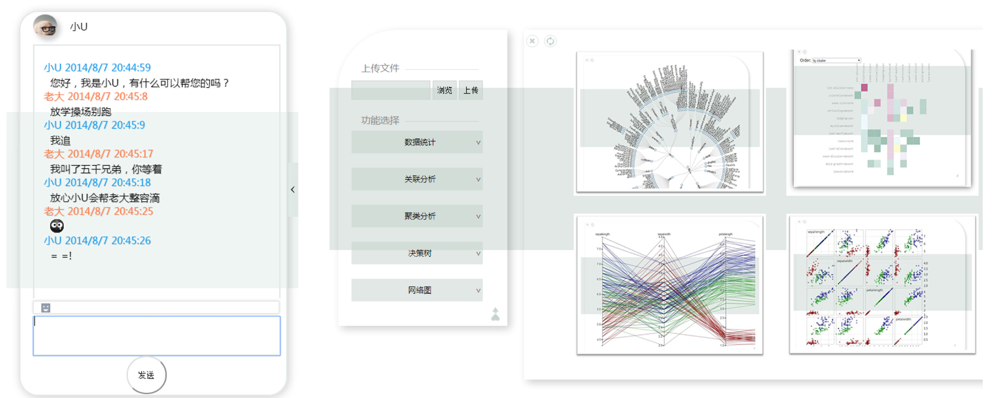
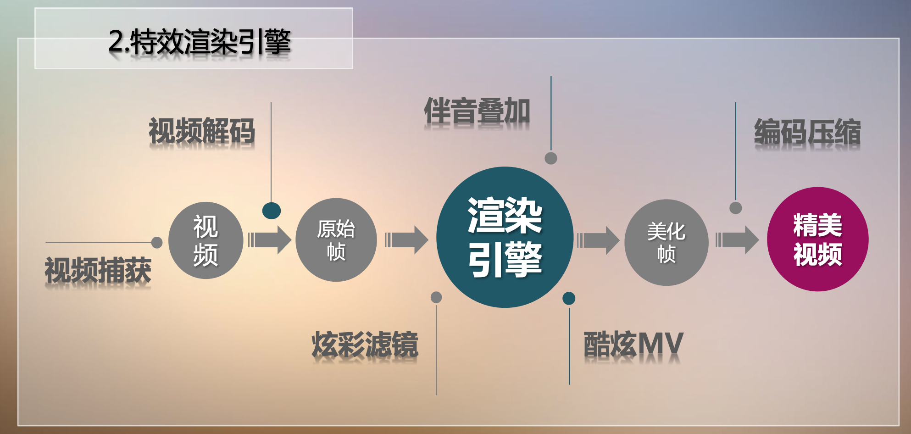

# Project

This repository is meant to reorganize five projects that I built from 2012 to 2014, including: 1) a generic data mining visualization tool; 2) a Weibo social network mining system; 3) a video effect rendering engine; 4) a user-generated video sharing platform; 5) a 3D-roaming maze for graphic lighting. All of them are now open-sourced. The technical implementations and design philosophies can be found in each sub-repository. Disclaimer: these projects are built several years ago, and therefore some functions may be deprecated.

# Contents

Project 1: [Datartisan](https://github.com/QibingLee/Datartisan)

Project 2: [WeiboVis](https://github.com/QibingLee/WeiboVis)

Project 3: [VideoRendering](https://github.com/QibingLee/VideoEffectRendering)

Project 4: [LifeEnergy](https://github.com/QibingLee/LifeEnergy)

Project 5: [GoghMaze](https://github.com/QibingLee/GoghMaze)

# Demo

